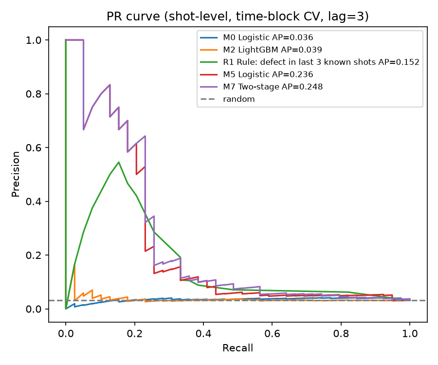
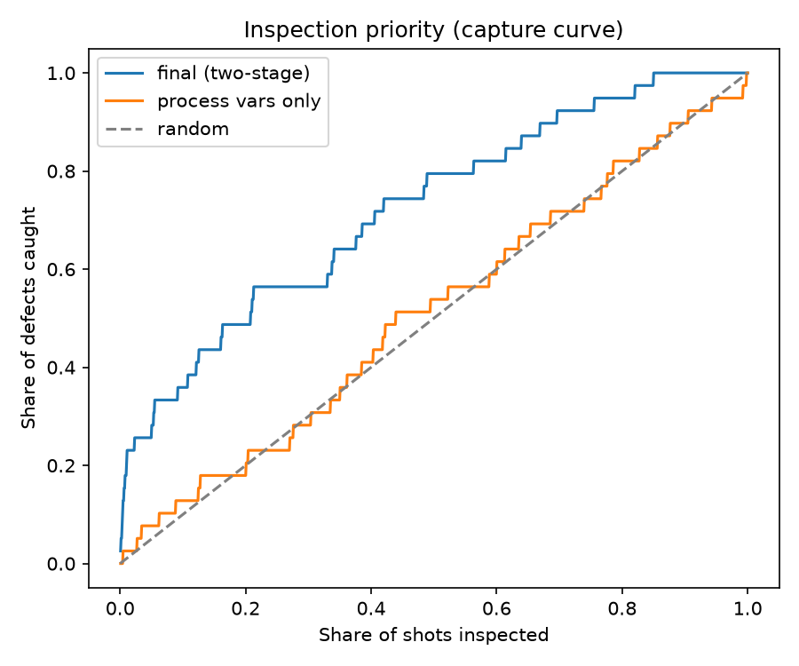

# Defects Come in Bursts — Injection Molding Defect Risk and Inspection Priority

*[한국어 README](README.ko.md)*

Predicting injection-molding defects **before final inspection**, and deciding **which shots to inspect first**, on the KAMP injection molding dataset.

Submitted to the **6th K-AI Manufacturing Data Analysis Competition (2026)**, general / university track.

> **Key results** (time-ordered validation, no leakage)
> Inspecting the riskiest **10% of shots catches 36% of defects** — 3.6× random.
> Calibrated risk tiers match reality: top tier predicted 11.5%, observed 11.2%.
> One command reproduces everything: `python run.py` (1–2 min, CPU).

---

## What the data actually said

### 1. Two identical rows per shot — the unit is the shot, not the part

1,144 pairs of consecutive rows have **all 24 process values identical**. All 42 defective parts sit inside these pairs, and in 36 pairs only one of the two parts failed.

Reading: a **two-cavity mold** — one injection shot produces two parts. Process values are logged per shot, quality per part. *(Inferred from structure; the data has no cavity ID.)*

No model can tell two parts with identical inputs apart, so the target was redefined as **shot-level defect risk**: 1,249 shots, 39 risky (3.1%).

### 2. Process values alone don't generalize — the "good" scores were leakage

| Split (same LightGBM, process values only) | PR-AUC (random baseline) | Precision |
|---|---|---|
| Part-level, random split | 0.152 (0.018) | 0.758 |
| Shot-level, random split | 0.096 (0.031) | 0.140 |
| **Shot-level, time-block split** | **0.042 (0.031)** | **0.092** |

Random splits put twin rows and neighboring shots on both sides. Once that is blocked, the process-value model is close to random — **it was memorizing the time period, not the defect**.

### 3. Defects come in bursts

27 of 39 risky shots (69%) had another defect within the previous 20 shots. When one of the previous 3 shots was defective, about **16%** of next shots fail, versus **3%** overall. The process is not a coin flip: once it drifts into a bad state, it stays there until someone fixes it.

---

## Approach: a two-stage risk score

```
Shot finishes → process values logged
      │
      ├─ known defect in the last 3 inspected shots?  ── yes ─→ Stage A: defect-history logistic model
      │                                                          (the process is in a bad state)
      └─ no ─────────────────────────────────────────────────→ Stage B: process-value LightGBM rank
                                                                 (weak signal for a burst starting)
      ↓
5-seed ensemble → Platt calibration → risk tier (high / mid / low)
```

- Inspection results are assumed to return **3 shots late** — shot *t* only knows results up to *t − 3*. Lags of 1/3/5/10 are reported.
- Validation: **5-fold group CV over 40-shot time blocks × 5 seeds**, so neither twin rows nor adjacent time periods leak.

## Results

| Model (same conditions) | PR-AUC per seed | PR-AUC 5-seed ensemble | Defects caught, top 10% / 20% |
|---|---|---|---|
| Logistic, process values (baseline) | 0.037 | 0.036 | 1 / 8 |
| LightGBM, process values | 0.042 | 0.039 | 5 / 7 |
| Rule: defect in last 3 known shots | 0.152 | 0.152 | 13 / 19 |
| Logistic, defect history only | 0.134 | 0.236 | 14 / 17 |
| LightGBM, process + history in one model | 0.038 | 0.036 | 4 / 9 |
| **Two-stage (final)** | **0.171** | **0.248** | **14 / 19** |

Random baseline PR-AUC = 0.031 (defect rate).



| Inspect top | Defects caught (of 39) | vs. random |
|---|---|---|
| 5% | 11 | 5.6× |
| 10% | 14 | 3.6× |
| 20% | 19 | 2.4× |
| 50% | 31 | 1.6× |



**How fast results return matters more than the model.** PR-AUC is 0.257 with a 1-shot lag and 0.058 with a 10-shot lag.

## Where it fails — stated plainly

- **The first defect of a burst is not caught** (12 of 12 missed at the F1 threshold). With no recent defect there is no history signal, and the process signal is weak.
- **Defects far from the previous one** (6–20 shots later) fall outside the 3-shot window — 11 of 18 missed follow-on defects.
- **Scattered defects** (product rg3) are mostly missed; the method works where defects cluster (cn7).
- **The two-stage structure beats history-only by a thin margin** (0.248 vs 0.236). Its real value is a calibrated probability usable for inspection tiers.
- Things tried and dropped: unsupervised anomaly detection on 71k unlabeled rows (ROC 0.44), 13 domain-derived ratio/difference features (no gain).

## Run it

```bash
pip install -r requirements.txt
# put the four KAMP CSV files in data/ (see data/README.md)
python run.py
```

Everything — diagnosis, model comparison, error analysis, inspection priority, test predictions — is written to `outputs/`, with the full log in `outputs/summary.txt`. Seeds are fixed; reruns give identical results.

## Stack

Python 3.13 · pandas · scikit-learn · LightGBM (built-in TreeSHAP) · matplotlib

## License

Code: MIT. Data: owned by KAMP, not redistributed here.
